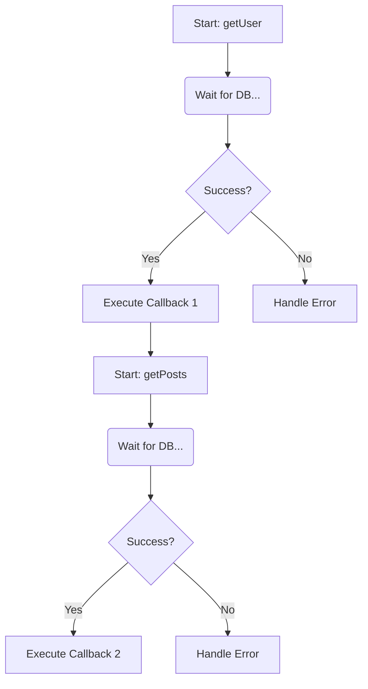
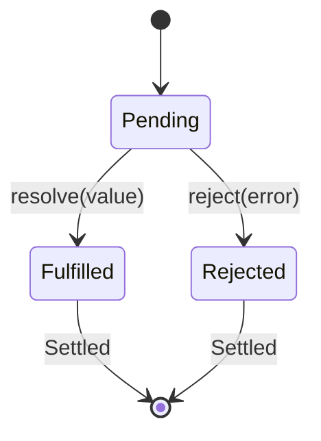
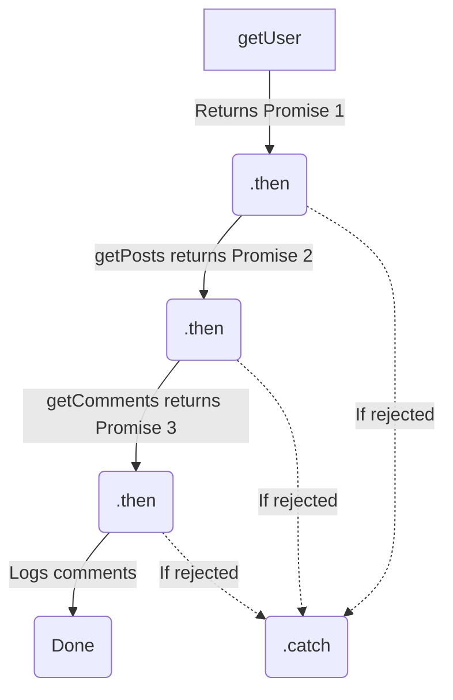
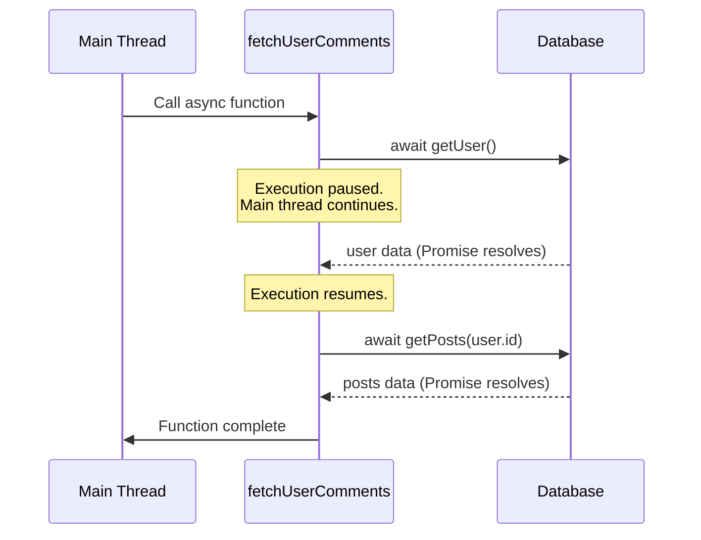

# Promises and Asynchronous Programming in JavaScript

JavaScript is single-threaded and uses a non-blocking, event-driven I/O model. This means that instead of pausing the thread to wait for a database query or an HTTP request to finish, it hands the task off to the environment (like Node.js or the browser) and continues executing the rest of the code.

This non-blocking nature is what makes Node.js fast for web servers, but it introduces a major challenge: **How do we know when the asynchronous task is done?**

## 1. The Problem: "Callback Hell" (The Pyramid of Doom)

Before Promises existed, JavaScript relied entirely on **Callbacks**. A callback is simply a function passed into another function, which gets executed when the asynchronous operation completes.

If you had a sequence of asynchronous tasks where Task 2 depends on Task 1, and Task 3 depends on Task 2, you had to nest callbacks inside callbacks.

```javascript
// The Pyramid of Doom / Callback Hell
getUser(userId, function(user) {
    getPosts(user.id, function(posts) {
        getComments(posts[0].id, function(comments) {
            console.log(comments);
        });
    });
});
```

**Why is this bad?**
1. **Unreadable**: The code grows horizontally instead of vertically.
2. **Error Handling is a nightmare**: You have to pass and check error objects at every single level of nesting.



## 2. The Solution: Promises

A Promise is an object representing the eventual completion (or failure) of an asynchronous operation and its resulting value. It is essentially an IOU (I Owe You) for a future value.

Instead of passing a callback *into* a function, the function returns a Promise object, which you can then attach callbacks *onto*.

### The Promise State Machine

A Promise is always in one of three states:
1. **Pending**: Initial state, neither fulfilled nor rejected. The operation is ongoing.
2. **Fulfilled (Resolved)**: The operation completed successfully.
3. **Rejected**: The operation failed (an error occurred).

Once a Promise is fulfilled or rejected, it is considered **settled**. It cannot change state again.



### Consuming Promises

You interact with a Promise using these chainable methods:
- `.then(value => { ... })`: Called when the promise is fulfilled. It receives the resolved value. **Crucially, `.then()` always returns a new Promise**, allowing you to chain them horizontally.
- `.catch(error => { ... })`: Called when the promise is rejected. It catches errors from the original promise or any preceding `.then()`.
- `.finally(() => { ... })`: Called when the promise is settled. Great for cleanup logic (like closing a DB connection).

### Solving Callback Hell with Promise Chaining

```javascript
getUser(userId)
    .then(user => getPosts(user.id))
    .then(posts => getComments(posts[0].id))
    .then(comments => console.log(comments))
    .catch(error => console.error("An error occurred somewhere in the chain:", error));
```



## 3. The Modern Era: `async` / `await`

While Promise chaining solved the deep nesting of Callback Hell, long chains of `.then()` can still be difficult to read, leading to a lesser-known issue called **"Promise Hell"**.

To fix this, ES2017 introduced `async` and `await`. This is syntactic sugar over Promises, making asynchronous code look and behave exactly like traditional, blocking, synchronous code (like in Java).

- **`async` function**: Adding `async` before a function means the function will *always* return a Promise.
- **`await` operator**: Can only be used inside an `async` function. It pauses the execution of that specific function until the awaited Promise is settled. It does *not* block the main JavaScript thread, it just yields control back to the event loop.

### Handling Errors
Instead of `.catch()`, you use standard `try...catch` blocks, making it highly familiar to Java developers.

```javascript
async function fetchUserComments(userId) {
    try {
        const user = await getUser(userId);
        const posts = await getPosts(user.id);
        const comments = await getComments(posts[0].id);
        console.log(comments);
    } catch (error) {
        // Catches errors from ANY of the await statements above
        console.error("Failed to fetch data", error);
    }
}
```



## 4. Advanced Promise Combinators

When you have multiple async operations, you don't always want to execute them sequentially. JS provides built-in methods for concurrent promises:

- **`Promise.all([p1, p2])`**: Waits for ALL promises to fulfill. If ANY promise rejects, the entire `Promise.all` rejects immediately. Good for when you need all data to proceed.
- **`Promise.allSettled([p1, p2])`**: Waits for all promises to settle (fulfill or reject). Returns an array of objects describing the outcome of each promise. Good for independent tasks.
- **`Promise.race([p1, p2])`**: Returns the result of the FIRST promise to settle (either fulfill or reject). Good for setting timeouts on requests.

[View Examples](../examples/4_promises/index.js)
