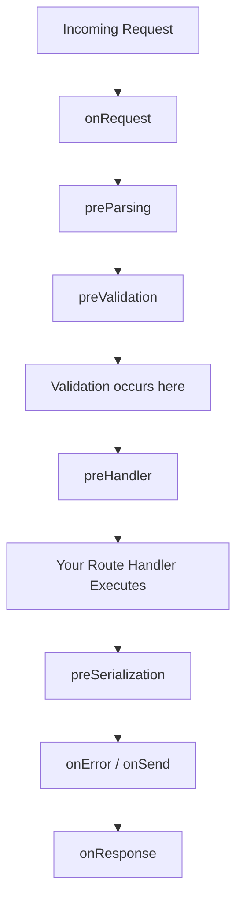

# Fastify: The Definitive Guide for Enterprise Engineers

Welcome to the definitive, deep-dive guide to **Fastify**, the high-performance web framework for modern Node.js applications. This document is designed specifically for engineers transitioning from mature, strongly-typed ecosystems like Java Spring Boot, .NET Core, or Go, who demand rigorous structure, validation, and performance out of their web APIs.

We will dissect every layer of the Fastify architecture:
1.  **Writing APIs at Scale**: Plugin architecture, encapsulation, and the Fastify instance lifecycle.
2.  **Request & Response Validation**: How Fastify leverages JSON Schema, `ajv`, and `fast-json-stringify` to create a type-safe boundary identical to Java DTOs.
3.  **Hooks and the Request Lifecycle**: Intercepting requests, filtering traffic, modifying payloads, and understanding the precise order of execution.
4.  **Handling Upstream Errors**: Strategies for gracefully failing when external APIs, microservices, or databases go down, utilizing `@hapi/boom` for standardized HTTP responses.
5.  **Database Integration (Cassandra)**: A deep dive into connecting Fastify to an Apache Cassandra cluster, handling connection pooling, DataStax drivers, consistency levels, and CQL error mapping.

---

## Part 1: Architecture and Writing APIs at Scale

When coming from Java Spring Boot, you are accustomed to the concept of Dependency Injection (DI) containers and the Application Context. Spring automatically scans your packages, instantiates singletons (like Services, Repositories, and Controllers), and injects them where needed.

Node.js frameworks generally do not use complex reflection-based DI containers. Instead, Fastify relies on a paradigm called **Encapsulated Contexts via Plugins**.

### 1.1 The Core Concept: Everything is a Plugin

In Fastify, *everything* is a plugin. A plugin is simply a function that receives the `fastify` instance as its first argument.

```javascript
// A simple Fastify Plugin
async function myPlugin(fastify, options) {
  // We can register decorators (like injecting a database service)
  fastify.decorate('utility', function () {
    return 'I am a globally available utility!';
  });

  // We can register routes
  fastify.get('/ping', async (request, reply) => {
    return { pong: fastify.utility() };
  });
}
```

When you call `fastify.register(myPlugin)`, Fastify executes that function and applies the routes and decorators.

**Understanding Encapsulation**:
Unlike older middleware patterns which alter the global state of the application and pollute the request object for every subsequent route, Fastify creates a new encapsulated context every time you call `fastify.register()`. If `Plugin A` registers a decorator or a hook, and `Plugin B` is registered alongside it, `Plugin B` *cannot* see `Plugin A`'s decorators. They are isolated.

This isolation is what allows enterprise teams to build massive monolithic codebases or microservices without fear of global scope pollution. If you have a `users` module and an `orders` module, they can operate entirely independently. If you *want* a plugin to be available globally (like a Database connection pool), you wrap it in the `fastify-plugin` utility, which explicitly tells Fastify to break the encapsulation barrier and attach the contents to the parent context.

This architectural decision mimics the scoping of Beans in a Spring Application Context. You have your global Singleton beans (database connections, loggers) and your Request-scoped or Prototype beans. By mastering `fastify.register()`, you dictate exactly which routes have access to which services.

### 1.2 Constructing Endpoints: Shorthand vs. Full Declaration

When writing APIs, you need to bind HTTP methods and URLs to your business logic handlers.

**The Shorthand Method**: This is quick and familiar to developers coming from lightweight frameworks like Sinatra. You call a method corresponding to the HTTP verb.
```javascript
fastify.get('/users/:id', async (request, reply) => {
  const userId = request.params.id;
  // ... fetch user from DB ...
  return { id: userId, name: "Alice" };
});
```

**The Full Route Declaration**: In enterprise applications, the shorthand method becomes unwieldy when you start adding validation schemas, pre-handlers (middleware), and custom log levels. Fastify provides the `fastify.route()` method, which accepts a configuration object. This is highly analogous to decorating a Java controller method with `@GetMapping`, `@Valid`, and `@PreAuthorize`.

```javascript
fastify.route({
  method: 'POST',
  url: '/users',
  schema: { ... }, // Defined later
  preHandler: async (request, reply) => {
    // Check authentication here
  },
  handler: async (request, reply) => {
    // Business logic
  }
});
```

By decoupling the route configuration from the handler function, you can easily extract your handlers into separate `Controller` files, resulting in a clean MVC architecture:

```javascript
// userController.js
export const createUserHandler = async (request, reply) => { ... }

// userRoutes.js
import { createUserHandler } from './userController.js';
import { createUserSchema } from './userSchemas.js';

export default async function userRoutes(fastify, options) {
  fastify.route({
    method: 'POST',
    url: '/',
    schema: createUserSchema,
    handler: createUserHandler
  });
}
```

---

## Part 2: Request/Response Validation and Hooks

One of the most fragile parts of any web API is the boundary layer—the point where untyped HTTP requests enter your application. In Java, this is solved by converting the raw HTTP body into strongly typed Objects (DTOs) and validating them using JSR 380 annotations like `@NotNull` or `@Min`.

Node.js is dynamically typed. If a client sends `{"age": "twenty"}`, JavaScript will happily accept the string, potentially causing database crashes or NaN calculations deep within your business logic.

### 2.1 The Validation Engine: JSON Schema and Ajv

Fastify solves this by making **JSON Schema** validation a first-class citizen of the framework.

Instead of writing manual `if (typeof request.body.age !== 'number')` checks in every controller, you define a schema. Fastify uses a high-performance library called `ajv` (Another JSON Schema Validator) to compile your schema into a highly optimized, flat JavaScript function during the server startup phase.

This means validation at runtime is incredibly fast—essentially identical in performance to a hand-written `if` statement.

You can validate four distinct parts of the incoming HTTP request:
1.  **`body`**: The payload of POST, PUT, or PATCH requests.
2.  **`querystring`**: The query parameters appended to the URL (`?limit=10&sort=desc`). Fastify automatically coerces string numbers into actual Number types if your schema demands it!
3.  **`params`**: The dynamic segments of your URL path (`/users/:userId`).
4.  **`headers`**: Custom HTTP headers (e.g., enforcing an `X-Correlation-ID`).

If any of these validations fail, Fastify intercepts the request *before* your handler is ever executed. It immediately returns a standardized `400 Bad Request` JSON response detailing exactly which property failed validation and why.

### 2.2 Response Serialization: The `fast-json-stringify` Engine

Validation isn't just for incoming requests; it is equally crucial for outgoing responses. Fastify allows you to define a `response` schema based on the HTTP status code.

```javascript
const userSchema = {
  response: {
    200: {
      type: 'object',
      properties: {
        id: { type: 'string' },
        name: { type: 'string' },
        email: { type: 'string' }
      }
    }
  }
};
```

This feature is a game-changer for two reasons:
1.  **Data Security (Data Leak Prevention)**: If your database query returns a complete User object including a `password_hash`, `salt`, and `credit_card_stripe_id`, returning that raw object to the client is a massive security breach. By defining a response schema that *only* includes `id`, `name`, and `email`, Fastify will strictly filter out any undeclared properties before sending the payload over the wire.
2.  **Raw Performance**: Node's native `JSON.stringify()` has to inspect every property of an object at runtime to determine its type before serializing it. Fastify uses `fast-json-stringify`. Because Fastify knows the exact shape of your response *ahead of time* from the schema, it generates a custom, highly-optimized string concatenation function at startup. This makes Fastify's response serialization 2x to 3x faster than native `JSON.stringify()`.

### 2.3 The Request Lifecycle and Hooks

Fastify operates on a strict lifecycle. When a request hits the server, it travels through a series of "Hooks" (similar to Spring's `HandlerInterceptor` or Servlet Filters).



You can attach logic to any of these hooks to intercept and modify the request.

---

## Part 3: Filtering Requests

To build a robust enterprise API, you must filter malicious or unauthorized traffic before it consumes valuable CPU cycles or database connections. This is done using Fastify's Hooks.

### 3.1 The `onRequest` Hook: Global Filtering

The `onRequest` hook is the very first thing executed when a connection is established. The request body hasn't even been parsed yet. This is the perfect place to drop connections from banned IP addresses or enforce strict rate limiting.

```javascript
fastify.addHook('onRequest', async (request, reply) => {
  const clientIp = request.ip;
  const bannedIps = ['192.168.1.100', '10.0.0.5'];

  if (bannedIps.includes(clientIp)) {
    // Dropping the request immediately!
    // Using @hapi/boom to generate a standard 403 Forbidden
    throw Boom.forbidden('Your IP has been banned.');
  }
});
```

### 3.2 The `preHandler` Hook: Authentication and Authorization

By the time the `preHandler` hook fires, Fastify has already parsed the body, validated the JSON schema, and routed the request. This is the ideal location to verify JWT tokens, check session cookies, or verify user roles against a database.

```javascript
fastify.route({
  method: 'GET',
  url: '/admin/dashboard',
  preHandler: async (request, reply) => {
    // Assume we have a JWT validation plugin attached to request
    const user = await request.verifyToken();

    if (user.role !== 'ADMIN') {
      throw Boom.unauthorized('Administrator privileges required');
    }

    // We can attach the verified user to the request object for the handler to use
    request.user = user;
  },
  handler: async (request, reply) => {
    // Business logic...
    return { sensitiveData: "classified" };
  }
});
```

**Why use Hooks instead of standard logic inside the Handler?**
Separation of concerns. By moving authentication, IP filtering, and rate limiting into Hooks, your route handlers remain completely ignorant of the transport layer. A controller's only job should be taking verified, validated data, calling a service layer to perform business logic, and returning the result. This makes your code highly testable, as you can unit test the controller function directly without needing to mock HTTP headers or JWT cryptographic signatures. Furthermore, because hooks can be registered at the plugin level, you can apply a single `preHandler` authentication hook to an entire encapsulated block of routes with just one line of code, ensuring no route accidentally bypasses security.

---

## Part 4: Handling Upstream Errors and `@hapi/boom`

In a microservices architecture, your Fastify application rarely exists in a vacuum. It must communicate with Upstream APIs (payment gateways, CRM systems, other internal microservices) and databases.

When these upstream dependencies fail, timeout, or return garbage data, your application must handle it gracefully. A crash or an unhandled Promise rejection is unacceptable.

### 4.1 The Mechanics of Upstream Failures

When calling another API (e.g., using Node's native `fetch` or the high-performance `undici` library), several things can go wrong:
1.  **Network Level Failures**: DNS resolution fails, connection refused, or TCP timeouts.
2.  **Protocol Level Failures**: The upstream service returns a 502 Bad Gateway, 503 Service Unavailable, or a 429 Too Many Requests.
3.  **Application Level Failures**: The upstream service returns a 200 OK, but the JSON payload is malformed or indicates a business logic error.

### 4.2 Using Try/Catch with Async/Await

Because Fastify natively supports `async/await`, handling these errors is identical to Java's `try/catch` blocks.

```javascript
import { request } from 'undici';
import Boom from '@hapi/boom';

async function fetchUserData(userId) {
  try {
    const { statusCode, body } = await request(`http://internal-user-service/users/${userId}`);

    if (statusCode === 404) {
       // Upstream microservice doesn't have the user
       throw Boom.notFound(`User ${userId} not found in upstream service`);
    }

    if (statusCode >= 500) {
       // Upstream is having issues. We shouldn't crash, we should return a 502 Bad Gateway
       throw Boom.badGateway('Upstream user service is currently unavailable');
    }

    const data = await body.json();
    return data;

  } catch (error) {
    // This catches actual Network/TCP errors thrown by undici
    if (!error.isBoom) {
       // Wrap the unexpected system error in a Boom 503
       throw Boom.serverUnavailable('Failed to communicate with user service', error);
    }
    // If it's already a Boom error, re-throw it so the global handler catches it
    throw error;
  }
}
```

### 4.3 The Global Error Handler (`setErrorHandler`)

As discussed briefly in previous sections, Fastify allows you to intercept *any* error thrown by a hook or a handler before it is serialized and sent to the client.

By combining `fastify.setErrorHandler` with `@hapi/boom`, you create an impenetrable wall that prevents stack traces from leaking to the client, while ensuring API consumers always receive a standardized, predictable JSON error payload.

```javascript
fastify.setErrorHandler((error, request, reply) => {
  // 1. Log the error internally for Datadog/Splunk/ELK
  request.log.error(error);

  // 2. Check if the error is a Fastify Schema Validation Error
  if (error.validation) {
    return reply.status(400).send({
      statusCode: 400,
      error: 'Bad Request',
      message: error.message,
      details: error.validation // Give the client the exact validation failures
    });
  }

  // 3. Check if we explicitly threw a Boom error (e.g. Boom.notFound())
  if (error.isBoom) {
    return reply
      .status(error.output.statusCode)
      .headers(error.output.headers)
      .send(error.output.payload);
  }

  // 4. Fallback: This is an unexpected exception (e.g. a Null Pointer Exception, DB Crash)
  // We NEVER send the raw error to the client to avoid leaking infrastructure details.
  // Instead, we use Boom to generate a generic 500 response.
  const genericError = Boom.internal('An unexpected internal error occurred');
  reply.status(500).send(genericError.output.payload);
});
```

---

## Part 5: Database Support (Apache Cassandra)

Node.js is database agnostic. Unlike Spring Boot which tightly couples with JPA/Hibernate, Node.js applications use specific drivers or ORMs for their target databases.

For high-throughput, distributed systems, **Apache Cassandra** is a common choice. We interact with it using the official `cassandra-driver` provided by DataStax.

### 5.1 Architecture: The Cassandra Driver

The `cassandra-driver` is heavily optimized for Node.js's asynchronous architecture.

**Connection Pooling**: You do *not* create a new client for every request. Creating a Cassandra session involves negotiating protocols, discovering the cluster topology, and opening multiple TCP connections to various nodes. You create a single `Client` instance when the Fastify server starts, and the driver internally manages a pool of multiplexed connections. Because Node.js is non-blocking, a single Cassandra connection can have thousands of queries in flight simultaneously.

**Consistency Levels**: Cassandra is a distributed NoSQL database. Every query must declare a Consistency Level (e.g., `LOCAL_QUORUM`, `ONE`, `ALL`), dictating how many nodes must acknowledge the read or write before it is considered successful.

### 5.2 Creating a Fastify Cassandra Plugin

To integrate Cassandra cleanly into Fastify, we use the `fastify-plugin` module. This allows us to instantiate the database client once, and attach it to the Fastify instance so it is available to all routes.

```javascript
import fp from 'fastify-plugin';
import cassandra from 'cassandra-driver';
import Boom from '@hapi/boom';

// Define the plugin
async function cassandraPlugin(fastify, options) {
  // 1. Configure the DataStax Client
  const client = new cassandra.Client({
    contactPoints: ['127.0.0.1:9042'], // Address of your Cassandra nodes
    localDataCenter: 'datacenter1',
    keyspace: 'my_keyspace',
    // We configure pooling and retry policies here
    pooling: {
      coreConnectionsPerHost: {
        [cassandra.types.distance.local]: 2,
        [cassandra.types.distance.remote]: 1
      }
    }
  });

  try {
    // 2. Await the connection
    await client.connect();
    fastify.log.info('Successfully connected to Apache Cassandra cluster.');

    // 3. Attach the connected client to the Fastify instance
    // Now, any route can call `fastify.cassandra.execute(...)`
    fastify.decorate('cassandra', client);

  } catch (err) {
    fastify.log.error('Failed to connect to Cassandra during startup');
    throw err; // Stop the server from booting if DB is down
  }

  // 4. Graceful Shutdown
  // When Fastify closes, ensure we drain the Cassandra connection pool
  fastify.addHook('onClose', async (instance) => {
    await instance.cassandra.shutdown();
  });
}

// Wrap it in fp() to break encapsulation and make `fastify.cassandra` globally available
export default fp(cassandraPlugin);
```

### 5.3 Executing Queries and Handling CQL Errors

When writing route handlers, we interact with the `fastify.cassandra` client. Cassandra errors (CQL Errors) must be caught and translated into HTTP errors.

```javascript
fastify.get('/users/:userId', async (request, reply) => {
  const { userId } = request.params;

  // Parameterized query to prevent CQL Injection!
  const query = 'SELECT user_id, name, email FROM users WHERE user_id = ?';
  const params = [ userId ];

  try {
    // Execute the query using LOCAL_QUORUM consistency
    const result = await fastify.cassandra.execute(query, params, {
      prepare: true,
      consistency: fastify.cassandra.types.consistencies.localQuorum
    });

    if (result.rowLength === 0) {
      // Data not found in the cluster
      throw Boom.notFound(`User ${userId} does not exist.`);
    }

    const userRow = result.first();
    // Map the raw Cassandra row to our desired JSON format
    return {
      id: userRow.user_id,
      name: userRow.name,
      email: userRow.email
    };

  } catch (error) {
    // If it's already a Boom error (like our 404 above), re-throw it
    if (error.isBoom) throw error;

    // Otherwise, we must inspect the Cassandra driver error
    fastify.log.error(error);

    if (error instanceof fastify.cassandra.errors.NoHostAvailableError) {
       // The cluster is entirely unreachable
       throw Boom.serverUnavailable('Database cluster is currently down');
    }

    if (error instanceof fastify.cassandra.errors.ResponseError) {
       // Cassandra responded, but the query failed (e.g. timeout, syntax error, unavailable exception)
       throw Boom.badGateway('Database operation failed');
    }

    // Generic fallback
    throw Boom.internal('An unexpected database error occurred');
  }
});
```

**Deep Dive on Cassandra Data Modeling vs RDBMS**:
When working with Cassandra in Node.js, you must fundamentally shift your mental model away from Relational Databases like PostgreSQL or MySQL. Cassandra does not support JOINS. You cannot establish foreign key constraints. Your tables must be designed strictly around your query patterns. If you need to retrieve a user by their email address, and also retrieve a user by their UUID, you cannot simply add an index to the email column and expect performant reads. You must create two separate tables: `users_by_id` and `users_by_email`, and you must write the data to both tables simultaneously.

The `cassandra-driver` for Node.js provides a `BatchStatement` API specifically for this purpose, allowing you to execute multiple mutations (INSERTs/UPDATEs) atomically. When designing your Fastify APIs backed by Cassandra, your schema validation must be incredibly strict, because Cassandra's storage engine will not perform the data integrity checks you might expect from an RDBMS. You must validate the exact shape of your partition keys and clustering columns in your route schemas before the query is ever dispatched to the `execute()` function.

---

## Part 6: Deploying Fastify in Enterprise Environments

When your application is ready for production, Node.js behaves very differently than a Java application server like Tomcat or JBoss.

A Java application server can be allocated 16GB of heap space and utilize 32 CPU cores seamlessly to handle thousands of concurrent threads. Node.js, on the other hand, is restricted to a single V8 JavaScript thread. If you deploy a single Node.js process on a 32-core machine, 31 of those cores will sit completely idle while your application is overloaded!

To solve this, Fastify applications are typically deployed using one of two strategies:

### 6.1 The Node.js Cluster Module

Node.js provides a built-in `cluster` module. This module allows you to write a master script that spawns multiple worker processes (one for each CPU core). The master process listens on a single port (like 8080) and distributes incoming TCP connections to the worker processes using a round-robin algorithm.

This means if you have an 8-core server, you will have 8 independent instances of your Fastify application running simultaneously, each with its own V8 engine, its own memory heap, and its own event loop. They do not share memory! This is a "Shared Nothing" architecture. If you need to share state (like user sessions or rate limiting counters) between these 8 instances, you must use an external data store like Redis or Memcached.

### 6.2 Containerization and Kubernetes

In modern cloud-native environments, developers completely ignore the Node.js `cluster` module. Instead, they package the Fastify application into a lightweight Docker container.

Because Node.js is so efficient, a single Fastify container might only need 128MB of RAM and 0.5 CPU cores to operate at peak efficiency.

You deploy these containers to an orchestration platform like Kubernetes. Kubernetes handles the scaling. If traffic spikes, Kubernetes automatically spins up 10, 50, or 100 identical Fastify containers across your server cluster, and an Ingress Controller (like NGINX or HAProxy) load-balances the HTTP requests across all of them.

This containerized approach perfectly complements Fastify's incredibly fast startup time. A Spring Boot application might take 15 to 30 seconds to boot up and initialize its Application Context before it can accept traffic. A Fastify application, even one with hundreds of routes and complex JSON schemas, typically starts in under 200 milliseconds. This rapid startup makes Fastify an ideal candidate for serverless environments (like AWS Lambda or Google Cloud Run) and highly elastic Kubernetes deployments where pods are constantly being created and destroyed based on real-time traffic demands.

---

## Part 7: Real-World Fastify Patterns

Moving beyond the basics of routing and validation, enterprise engineering teams must establish consistent patterns for testing, logging, and structuring dependencies. Fastify provides unique tools tailored specifically for these requirements.

### 7.1 Lightning-Fast Unit Testing with `.inject()`

In many Java web frameworks, testing an HTTP endpoint requires spinning up the entire embedded web server (like Tomcat), binding to a random port, and making real HTTP requests over the loopback interface using a tool like `RestTemplate` or `WebClient`. This is notoriously slow, and a test suite with hundreds of endpoints can take minutes to execute.

Fastify completely circumvents this bottleneck by providing the `fastify.inject()` API. Under the hood, `inject()` relies on the `light-my-request` library. It simulates an incoming HTTP request by constructing a mock `IncomingMessage` and `ServerResponse` object, and feeding them directly into Fastify's internal routing engine.

The server *never* binds to a TCP port. No actual network sockets are opened.

This allows you to execute end-to-end integration tests of your routes, schema validations, and hooks in milliseconds rather than seconds.

```javascript
import buildApp from '../src/app.js';

describe('User Registration Endpoint', () => {
  let app;

  beforeAll(async () => {
    // Instantiate our Fastify application but DO NOT call app.listen()
    app = await buildApp();
  });

  afterAll(async () => {
    await app.close();
  });

  it('should return 400 Bad Request when the schema is invalid', async () => {
    // We "inject" a mock request directly into the routing engine
    const response = await app.inject({
      method: 'POST',
      url: '/api/users',
      payload: {
        name: 'A' // Invalid: minLength is 2
      }
    });

    expect(response.statusCode).toBe(400);

    // The response body is a standard string, we can parse it
    const body = JSON.parse(response.payload);
    expect(body.message).toContain('name must NOT have fewer than 2 characters');
  });

  it('should return 201 Created on success', async () => {
    const response = await app.inject({
      method: 'POST',
      url: '/api/users',
      payload: {
        name: 'Alice',
        age: 30
      }
    });

    expect(response.statusCode).toBe(201);
    const body = JSON.parse(response.payload);
    expect(body.success).toBe(true);
  });
});
```

Because `.inject()` triggers the exact same request lifecycle (including all `onRequest` and `preHandler` hooks), you get 100% confidence that your routing and validation configuration works, without the massive performance overhead of TCP networking.

### 7.2 High-Performance Logging with Pino

Logging is often the hidden bottleneck in heavily trafficked Node.js applications. Node's `console.log()` is synchronous when writing to standard out/error, meaning excessive logging can actually block the V8 Event Loop.

Furthermore, `JSON.stringify()` is slow, so if your logger is constantly formatting complex JavaScript objects into JSON strings for your ELK stack or Datadog agent, you are bleeding CPU cycles.

Fastify solves this by integrating tightly with **Pino**, an extremely fast JSON logger.

Pino is heavily optimized for Node.js. It avoids `JSON.stringify()` almost entirely by using customized string concatenation algorithms, and it can offload the actual writing of the log data to a separate background worker thread, ensuring the main Event Loop is never blocked by I/O.

When you instantiate Fastify with `logger: true`, it automatically attaches a Pino logger instance to the application (`fastify.log`) and to every incoming request (`request.log`).

```javascript
fastify.get('/orders/:id', async (request, reply) => {
  // Use the request-specific logger!
  // It automatically injects the request ID into the log output so you can trace the transaction.
  request.log.info({ orderId: request.params.id }, 'Fetching order details');

  try {
    const order = await getOrder(request.params.id);
    return order;
  } catch (error) {
    // When logging errors, pass the Error object directly to Pino.
    // It will automatically serialize the stack trace and attach it.
    request.log.error(error, 'Failed to retrieve order');
    throw Boom.internal();
  }
});
```

### 7.3 Managing Dependencies: Decorators vs Context

In Java, Dependency Injection is ubiquitous. In Fastify, as discussed earlier, we use **Plugins** and **Decorators** to manage our shared services. However, there is an important distinction to make regarding *where* you attach these services.

You can decorate the global `fastify` instance, or you can decorate the `request` instance.

**1. Decorating the Fastify Instance (Singletons)**

If a dependency is stateless or manages its own internal multiplexing (like a database connection pool, a Redis client, or a utility function), you should decorate the main Fastify instance. This is equivalent to a Singleton Bean in Spring.

```javascript
fastify.decorate('db', new DatabaseClient());

fastify.get('/items', async (request, reply) => {
  // Access the singleton
  const items = await fastify.db.query('SELECT * FROM items');
  return items;
});
```

**2. Decorating the Request Instance (Request Scoped)**

If a piece of data is unique to the current HTTP transaction (like the authenticated User object, a Correlation ID for tracing, or a localized translation dictionary), you must decorate the `request` object.

```javascript
fastify.decorateRequest('user', null); // Initialize the property

fastify.addHook('preHandler', async (request, reply) => {
  const token = request.headers['authorization'];
  request.user = await verifyToken(token); // Populate the property for this specific request
});

fastify.get('/profile', async (request, reply) => {
  // Access the request-scoped data
  return { profile: request.user };
});
```

Attempting to attach request-specific data to the global `fastify` instance will result in a disastrous race condition where concurrent HTTP requests overwrite each other's data!

---

## Part 8: Advanced Data Modeling with Cassandra

Returning to our integration with Apache Cassandra, it is vital to understand that Cassandra's architecture dictates exactly how your Fastify application must structure its queries and schemas.

### 8.1 Understanding Partition Keys and Clustering Columns

In a relational database, you define tables and use indexes to make queries faster. In Cassandra, the primary key is entirely responsible for how data is physically distributed across the cluster.

A Cassandra Primary Key consists of two parts:
1.  **The Partition Key**: This determines *which node* in the cluster stores the data. Cassandra hashes this key and uses the resulting token to route the write/read request.
2.  **The Clustering Columns (Optional)**: This determines how the data is *sorted* on the disk within that specific partition.

Consider a time-series model for IoT sensor data:

```sql
CREATE TABLE sensor_readings (
    sensor_id uuid,
    recorded_at timestamp,
    temperature decimal,
    PRIMARY KEY (sensor_id, recorded_at)
) WITH CLUSTERING ORDER BY (recorded_at DESC);
```

In this table, `sensor_id` is the Partition Key, and `recorded_at` is the Clustering Column. All readings for a single sensor are guaranteed to be stored on the same physical server (the partition), and they are guaranteed to be stored chronologically descending on disk.

### 8.2 Writing Fastify Routes for Cassandra

Because of this physical data layout, your Fastify routes must map directly to these query patterns. You cannot query a Cassandra table without providing the Partition Key. A query like `SELECT * FROM sensor_readings WHERE temperature > 100` is impossible without allowing filtering (which triggers a full cluster scan and will crash your database).

Your Fastify schemas must strictly enforce that the client provides the necessary Partition Keys.

```javascript
const GetSensorHistorySchema = {
  params: {
    type: 'object',
    required: ['sensorId'],
    properties: {
      sensorId: { type: 'string', format: 'uuid' } // Strict validation!
    }
  },
  querystring: {
    type: 'object',
    properties: {
      limit: { type: 'integer', minimum: 1, maximum: 1000, default: 100 }
    }
  }
};

fastify.get('/sensors/:sensorId/history', { schema: GetSensorHistorySchema }, async (request, reply) => {
  const { sensorId } = request.params;
  const { limit } = request.query;

  // Because the schema guarantees sensorId is a valid UUID,
  // we can safely execute the CQL query knowing we are hitting a specific partition.
  const query = 'SELECT recorded_at, temperature FROM sensor_readings WHERE sensor_id = ? LIMIT ?';

  const result = await fastify.cassandra.execute(query, [sensorId, limit], { prepare: true });

  return result.rows;
});
```

### 8.3 The `prepare: true` Flag

In all our Cassandra examples, you will notice the `{ prepare: true }` option passed to the `execute()` function. This is critical for performance.

When you prepare a statement, the Cassandra driver sends the CQL string to the cluster *once*. The cluster parses the string, optimizes the execution plan, and returns an ID. For all subsequent executions of that query, the Node.js driver simply sends the ID and the raw parameter bytes over the wire.

This bypasses the parsing and planning phases on the database side entirely, resulting in massive throughput improvements. The DataStax driver handles caching these prepared statement IDs automatically under the hood, so you simply pass `{ prepare: true }` on every query and let the driver manage the lifecycle.

### 8.4 Handling Paged Result Sets

If your Cassandra partition is large (e.g., millions of rows for a single sensor), you cannot load them all into Node.js memory at once. It will blow up the V8 heap and crash your Fastify process.

The Cassandra driver handles this using **Paging States**. When you execute a query, you can specify a `fetchSize`. If there are more rows available, the driver returns a `pageState` string.

You must return this `pageState` to your API client, and they must provide it in the next HTTP request to fetch the next chunk of data.

```javascript
fastify.get('/sensors/:sensorId/history/paged', async (request, reply) => {
  const { sensorId } = request.params;
  const { pageState } = request.query; // The client passes this back to us via the query string

  const query = 'SELECT recorded_at, temperature FROM sensor_readings WHERE sensor_id = ?';

  const result = await fastify.cassandra.execute(query, [sensorId], {
    prepare: true,
    fetchSize: 500, // Only pull 500 rows into Node.js memory at a time
    pageState: pageState // Resume from where we left off
  });

  return {
    data: result.rows,
    // Return the new page state to the client so they can request the next batch
    nextPageState: result.pageState ? result.pageState.toString('hex') : null
  };
});
```

This pattern guarantees that your Fastify application consumes a fixed amount of memory regardless of how large the underlying database tables grow, allowing you to confidently scale your enterprise systems to petabytes of data without degrading API performance.

## Part 9: Securing Your Application at the Edge

A robust web application is defined by more than just its routing layer or database integration. The edge—where the internet meets your server—is a critical battleground for performance and security. We touched on using the `onRequest` hook for basic IP filtering, but let’s expand on enterprise-grade security practices within the Fastify ecosystem.

### 9.1 Cross-Origin Resource Sharing (CORS)

If you are building an API that will be consumed by a Single Page Application (like React, Angular, or Vue) running on a different domain, the browser will enforce the Same-Origin Policy. To allow the frontend to interact with your Fastify server, you must explicitly configure CORS headers.

Fastify provides an official plugin: `@fastify/cors`.

```javascript
import fastifyCors from '@fastify/cors';

// Register the plugin globally
fastify.register(fastifyCors, {
  // Allow specific origins
  origin: ['https://my-frontend.com', 'http://localhost:8080'],
  // Allow specific methods
  methods: ['GET', 'POST', 'PUT', 'DELETE'],
  // Expose headers if your frontend needs to read custom response headers (e.g. X-Pagination-Total)
  exposedHeaders: ['X-Pagination-Total'],
  // Allow credentials if your API relies on cookies instead of Bearer tokens
  credentials: true
});
```

By default, the plugin will handle `OPTIONS` preflight requests automatically, responding with a `204 No Content` and the appropriate `Access-Control-Allow-*` headers, completely removing the burden from your route handlers.

### 9.2 Rate Limiting to Prevent Abuse

In addition to filtering specific IP addresses, you must protect your endpoints against brute-force attacks and Denial of Service (DoS) attempts. The official `@fastify/rate-limit` plugin implements a sliding window algorithm to strictly control how many requests a specific client can make over a period of time.

```javascript
import rateLimit from '@fastify/rate-limit';
import Boom from '@hapi/boom';

fastify.register(rateLimit, {
  // Allow 100 requests every 1 minute
  max: 100,
  timeWindow: '1 minute',
  // You can customize the error response to seamlessly integrate with your Boom error handler
  errorResponseBuilder: (request, context) => {
    return Boom.tooManyRequests(`Rate limit exceeded, retry in ${context.after}`);
  }
});
```

Because Fastify's architecture is built on encapsulated contexts, you can apply aggressive rate limits to sensitive routes (like `/login` or `/password-reset`), and much looser limits to static assets or health checks.

### 9.3 Helmet and HTTP Security Headers

Security headers are small, specialized HTTP response headers that instruct the client browser to enable specific security protocols. The `@fastify/helmet` plugin automatically configures these for you.

For example, Helmet prevents "Clickjacking" by setting the `X-Frame-Options` header to `SAMEORIGIN`, telling the browser to refuse to render the application inside an `<iframe>` hosted on a malicious domain. It sets the `Strict-Transport-Security` header to enforce HTTPS connections, and the `X-XSS-Protection` header to enable built-in browser filtering against Cross-Site Scripting.

Adding this to your application is typically a single line of code during initialization:

```javascript
import helmet from '@fastify/helmet';

fastify.register(helmet, {
  // Global configuration options can be adjusted here, such as tweaking the Content-Security-Policy
});
```

By layering these specialized plugins (`cors`, `rate-limit`, `helmet`) on top of Fastify's core validation and routing capabilities, you establish a hardened API boundary that mimics the rigorous security configurations typical of heavy enterprise Java gateways, but with a fraction of the memory footprint and significantly higher execution speed.
