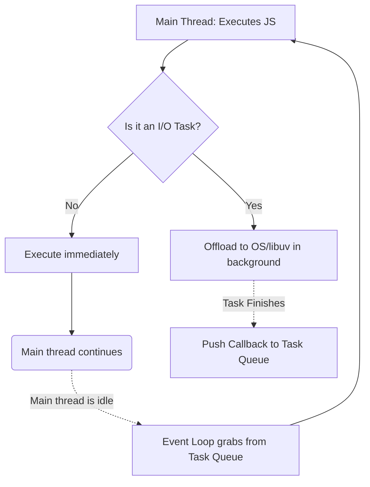
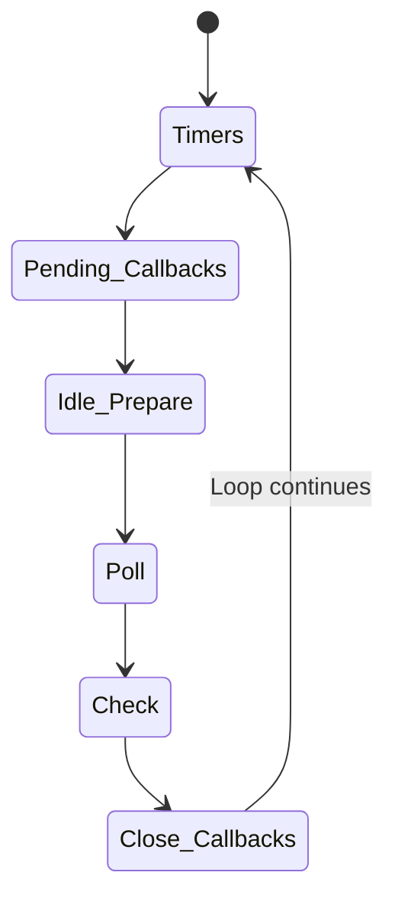

# Node.js Concurrency and The Event Loop

Coming from Java, you are used to a multi-threaded concurrency model. A new HTTP request comes in? Java spawns a new thread from the pool. If that thread blocks while waiting for a database query, it's fine; other threads continue to serve other users.

**Node.js is fundamentally different. JavaScript is strictly single-threaded.** There is only ONE main thread executing your JavaScript code.

So how does Node.js handle thousands of concurrent requests without blocking everyone while waiting for a single database query? The answer is the **Event Loop**.

## 1. The Core Concept: Non-Blocking I/O

When Node.js encounters an I/O operation (like reading a file, making an HTTP request, or querying a database), it **does not wait** for the result. Instead, it hands the task off to the operating system's kernel (or a background thread pool managed by a C library called `libuv`), registers a callback, and immediately moves on to the next line of code.

When the OS finishes the task, it pushes the callback into a queue. The Event Loop constantly checks this queue and executes the callbacks when the main thread is idle.



## 2. Anatomy of the Event Loop

The Event Loop isn't a magical black box; it's an infinite `while` loop that runs in specific **phases**. When Node.js starts, it initializes the event loop, processes the provided input script, and then begins processing the phases.

Each phase has a FIFO queue of callbacks to execute.

### The Phases of the Event Loop



1. **Timers**: Executes callbacks scheduled by `setTimeout()` and `setInterval()`.
2. **Pending Callbacks**: Executes I/O callbacks deferred to the next loop iteration (e.g., some types of TCP errors).
3. **Idle, Prepare**: Only used internally by Node.js.
4. **Poll**: Retrieve new I/O events; execute I/O related callbacks (almost all, with the exception of close callbacks, timers, and `setImmediate()`). If the queue is empty, Node.js will block here and wait for new events, *unless* there are scripts queued by `setImmediate()`.
5. **Check**: Executes callbacks scheduled by `setImmediate()`.
6. **Close Callbacks**: Executes close events (e.g., `socket.on('close', ...)`).

## 3. The "Microtask" Queues (The VIPs)

This is where it gets tricky. There are two special queues that are **not part of the event loop phases**. They are the VIP queues. They get processed *after the current operation completes, and before the event loop continues to the next phase*.

1. **`process.nextTick()` Queue**: This has the absolute highest priority. It runs immediately after the current operation, before any other queue.
2. **Promise Microtask Queue**: This handles `.then()`, `.catch()`, and `.finally()` callbacks from resolved Promises (and `async/await` continuations). It runs immediately after the `nextTick` queue empties.

### Execution Order:

1. Execute all synchronous code in the current script.
2. Execute all callbacks in the `process.nextTick()` queue.
3. Execute all callbacks in the Promise Microtask queue.
4. Enter the Event Loop (starting with Timers).
5. Between *every single phase* of the event loop, Node checks and empties the `nextTick` and `Promise` queues again before moving to the next phase.

```mermaid
flowchart TD
    SYNC[Execute Synchronous Code] --> NT[Empty process.nextTick Queue]
    NT --> PROMISE[Empty Promise Microtask Queue]
    PROMISE --> EL_TIMERS[Event Loop Phase: Timers]
    EL_TIMERS --> NT2[Empty nextTick & Promise Queues]
    NT2 --> EL_POLL[Event Loop Phase: Poll (I/O)]
    EL_POLL --> NT3[Empty nextTick & Promise Queues]
    NT3 --> EL_CHECK[Event Loop Phase: Check (setImmediate)]
    EL_CHECK --> NT4[Empty nextTick & Promise Queues]
```

## 4. The Golden Rule: Don't Block the Event Loop!

Because there is only one main thread, if you execute a computationally expensive, synchronous task (like a heavy `for` loop, parsing a massive JSON file, or calculating crypto hashes), **the event loop stops**.

If the loop stops, no pending I/O callbacks can execute, and no new HTTP requests can be accepted. Your server is effectively dead until that synchronous task finishes.

### How do we handle heavy CPU tasks then?

If you must do heavy CPU work (similar to a complex Java batch job), you cannot rely on normal Promises. Promises only defer I/O, they don't spawn new threads.

To solve this, Node.js provides **Worker Threads** (`require('node:worker_threads')`).

Worker Threads actually spawn separate V8 JavaScript engine instances in separate OS threads, allowing you to achieve true parallel execution for CPU-intensive tasks, exactly like Java multi-threading.

[View the Event Loop and Worker Thread Examples](../examples/8_concurrency/)
